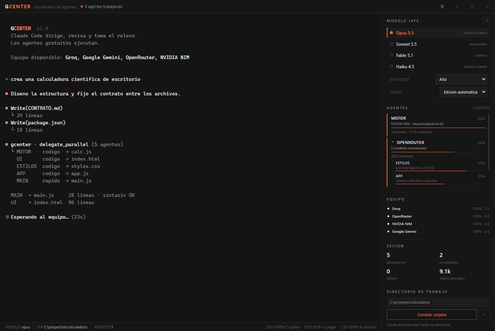
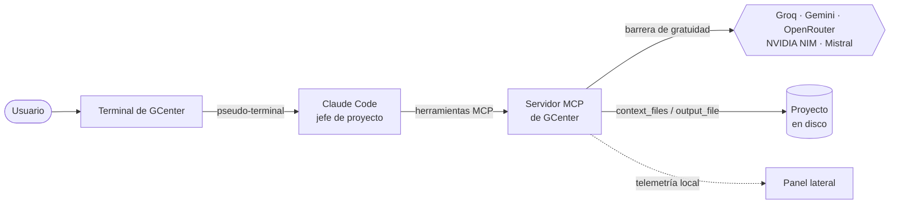

<div align="center">

# GCenter

**Claude Code dirige. Un equipo de modelos gratuitos ejecuta.**

Terminal de escritorio para Windows y Linux donde Claude Code actúa como jefe de proyecto,
reparte el trabajo entre modelos de IA gratuitos y solo gasta tus tokens en lo
que de verdad requiere su criterio.

[](https://github.com/toroc07/gcenter/actions/workflows/ci.yml)
[](LICENSE)




<sub>Interfaz real de la aplicación, con datos de demostración.</sub>

</div>

---

## Índice

- [Qué es](#qué-es)
- [Características](#características)
- [Cómo funciona](#cómo-funciona)
- [Instalación](#instalación)
- [Primeros pasos](#primeros-pasos)
- [Proveedores gratuitos](#proveedores-gratuitos)
- [Garantía de gratuidad](#garantía-de-gratuidad)
- [Por qué delegar ahorra tokens](#por-qué-delegar-ahorra-tokens)
- [Supervisión y relevo](#supervisión-y-relevo)
- [Uso de la interfaz](#uso-de-la-interfaz)
- [Desarrollo](#desarrollo)
- [Solución de problemas](#solución-de-problemas)
- [Seguridad y privacidad](#seguridad-y-privacidad)
- [Licencia](#licencia)

## Qué es

GCenter envuelve una sesión real de [Claude Code](https://claude.com/claude-code)
en una terminal con un panel lateral. Le da a Claude un equipo de modelos
gratuitos —Groq, Google Gemini, OpenRouter, NVIDIA NIM y Mistral— y las
herramientas para dirigirlo:

- **Jefe de proyecto.** Claude diseña la estructura, fija los contratos entre
  archivos y reparte las piezas en paralelo.
- **Último revisor.** Nada llega a tu proyecto sin pasar por su revisión.
- **Suplente.** Si los agentes de una especialidad se agotan, Claude continúa
  esa parte desde donde se quedó.

## Características

- **Delegación con ahorro real.** Los agentes leen los archivos de contexto y
  escriben su resultado directamente a disco. Claude recibe un resumen, no el
  código, y deja de pagar cada archivo dos veces.
- **Reparto por especialidad.** Claude pide `codigo`, `razonamiento`,
  `contextoLargo`, `redaccion`, `rapido` o `revision`, y GCenter elige el mejor
  modelo vivo.
- **Lotes paralelos diversificados.** Las tareas de un mismo lote se reparten
  entre proveedores distintos para no compartir cuota ni fallar todas a la vez.
- **Garantía de gratuidad.** Cualquier modelo de pago se rechaza antes de
  llamar al proveedor.
- **Control de calidad.** Detecta archivos que no compilan, bucles, eco del
  enunciado y negativas, y reintenta con otro modelo sin intervención de Claude.
- **Aprende de tus revisiones.** Las valoraciones de Claude reordenan el reparto
  y apartan a los modelos que rinden mal, también entre sesiones.
- **Autocuración.** Los modelos retirados, no desplegados o restringidos se
  detectan y se dejan de ofrecer solos.
- **Panel en vivo.** Agentes en curso, agrupados por proveedor; salud del
  equipo; tokens ahorrados.
- **Control de la sesión.** Modelo jefe, nivel de esfuerzo, modo de permisos y
  directorio de trabajo desde el panel lateral.
- **Tema claro y oscuro**, con un diseño sobrio de un único color de acento.

## Cómo funciona



GCenter arranca Claude Code con un servidor MCP propio y un prompt de
orquestador ([`prompts/orchestrator.md`](prompts/orchestrator.md)) que le explica
su papel. El servidor MCP expone seis herramientas:

| Herramienta | Para qué sirve |
|---|---|
| `agents_available` | Proveedores activos y sus modelos gratuitos, consultados en vivo |
| `delegate` | Encargar una tarea, por especialidad o a un modelo concreto |
| `delegate_parallel` | Hasta 8 tareas simultáneas, repartidas entre modelos distintos |
| `agents_health` | Parte de situación: quién falla, quién está agotado, qué queda sin cubrir |
| `agents_feedback` | Valorar un resultado para que el reparto aprenda |
| `agents_running` | Agentes en curso y acumulado de la sesión |

## Instalación

### Requisitos

- **Windows** 10 u 11 de 64 bits, o **Linux** x64 (Ubuntu 22.04+, Debian 12+ o
  equivalente)
- [Claude Code](https://claude.com/claude-code) instalado y con sesión iniciada
- Al menos una API key de un [proveedor gratuito](#proveedores-gratuitos)

### Descargas

Todos los paquetes están en [Releases](https://github.com/toroc07/gcenter/releases):

| Paquete | Sistema | Instalación |
|---|---|---|
| `GCenter-setup-<versión>.exe` | Windows | Instalador. **El recomendado**: arranca en menos de un segundo |
| `GCenter-portable-<versión>.exe` | Windows | Sin instalar; se autoextrae y es más lento al abrir |
| `gcenter_<versión>_amd64.deb` | Ubuntu, Debian y derivadas | `sudo apt install ./gcenter_<versión>_amd64.deb` |
| `GCenter-<versión>-x86_64.AppImage` | Cualquier distribución, sin instalar | `chmod +x GCenter-*.AppImage && ./GCenter-*.AppImage` |

### Claude Code en Linux

Se instala con su instalador oficial, o con npm:

```bash
curl -fsSL https://claude.ai/install.sh | bash
# o bien
npm install -g @anthropic-ai/claude-code
```

GCenter lo busca en `~/.local/bin`, en la carpeta global de npm (incluidas las
versiones de Node gestionadas con nvm) y en el `PATH`, así que lo encuentra
aunque lo abras desde el menú de aplicaciones.

> En Ubuntu 24.04 y posteriores, la AppImage puede negarse a arrancar por las
> restricciones de sandbox del sistema. El `.deb` no tiene ese problema. Ver
> [Solución de problemas](#solución-de-problemas).

### Desde el código fuente

```bash
git clone https://github.com/toroc07/gcenter.git
cd gcenter
npm install
npm start
```

Necesitas Node.js 18 o superior. Si `npm install` no descarga el binario de
Electron, fuérzalo con `node node_modules/electron/install.js`.

### Generar los paquetes

Cada sistema compila los suyos:

```bash
npm run dist          # en Windows: instalador y portable
npm run dist:linux    # en Linux: AppImage y .deb
```

Los paquetes **solo se pueden generar en su propio sistema**: npm instala
únicamente el binario de terminal (`node-pty`) de la plataforma en la que se
ejecuta, así que un paquete de Linux construido en Windows llevaría el binario
de Windows y no abriría el terminal.

### Publicar una versión

El workflow [`release.yml`](.github/workflows/release.yml) compila los dos
sistemas en paralelo, cada uno en su máquina de GitHub Actions, prueba el
servidor MCP y el terminal **dentro** de cada paquete, y solo si todo pasa crea
una única Release con los cuatro archivos:

```bash
git tag v1.0.0
git push origin v1.0.0
```

Para comprobarlo sin publicar nada, lánzalo a mano desde *Actions → Release →
Run workflow* y descarga los paquetes como artefactos.

## Primeros pasos

1. **En Windows, abre GCenter desde el Explorador**, no desde un terminal
   integrado (ver [Solución de problemas](#solución-de-problemas)).
2. La primera vez que trabajes en una carpeta, Claude Code te pedirá confirmar
   que confías en ella. Es de una sola vez.
3. Pulsa el engranaje del panel lateral y pega al menos una API key. **Empieza
   por Groq**: es gratis, no pide tarjeta y responde casi al instante.
4. Elige el directorio de trabajo en el panel inferior derecho.
5. Pide algo a Claude. Verás aparecer los agentes en el panel.

## Proveedores gratuitos

| Proveedor | Cuota gratuita | Dónde destaca | Variable |
|---|---|---|---|
| [Groq](https://console.groq.com/keys) | Sin tarjeta · 30 req/min · 1.000 req/día | Velocidad (~300 tok/s): código y refactors | `GROQ_API_KEY` |
| [Google Gemini](https://aistudio.google.com/apikey) | Sin tarjeta · ~10-15 req/min | Hasta 1M de tokens de contexto | `GEMINI_API_KEY` |
| [OpenRouter](https://openrouter.ai/settings/keys) | ~20 modelos `:free` · 50 req/día sin saldo | Variedad de modelos abiertos | `OPENROUTER_API_KEY` |
| [NVIDIA NIM](https://build.nvidia.com/) | Sin tarjeta · créditos gratuitos · ~40 req/min | Kimi K3, DeepSeek V4, Nemotron Ultra | `NVIDIA_API_KEY` |
| [Mistral](https://console.mistral.ai/api-keys) | Tier Experiment | Redacción, resumen y traducción | `MISTRAL_API_KEY` |

Las llaves se guardan en tu perfil de usuario, fuera del proyecto. También
pueden venir de variables de entorno, que tienen prioridad.

Los catálogos se consultan **en vivo**: los identificadores de modelo rotan cada
pocas semanas y una lista fija acabaría enviando a los agentes contra modelos
que ya no existen.

<details>
<summary><b>Proveedores que no se incluyen, y por qué</b></summary>

- **GitHub Models.** Retirado por completo el 30 de julio de 2026; su API
  devuelve `410 Gone`.
- **OpenCode Zen.** Desde septiembre de 2026 reserva su capa gratuita a su
  propia aplicación y devuelve `403 FreeTierError` a cualquier otra. Varias de
  sus familias gratuitas (Nemotron, Ling) están disponibles gratis a través de
  NVIDIA NIM y OpenRouter.
- **Cerebras.** Su tier gratuito pasó a ser una prueba que exige tarjeta.

</details>

## Garantía de gratuidad

Los catálogos mezclan modelos gratuitos con modelos de pago. En una auditoría
real, OpenRouter ofrecía 442 modelos de los que solo 19 eran gratuitos. Por eso
cada proveedor declara su política y **el modelo se valida antes de cada
llamada**:

| Proveedor | Política |
|---|---|
| Groq | Todo el catálogo: sin tarjeta no hay forma de facturar; pasarse de cuota devuelve `429` |
| Gemini | Solo Flash, Flash-Lite y Gemma; fuera Deep Research, los Pro recientes, vídeo, música e imagen |
| OpenRouter | Comprobación exacta contra el precio publicado: coste cero de entrada **y** de salida |
| NVIDIA NIM | Todo el catálogo: no admite tarjeta; al agotarse los créditos responde `402` |
| Mistral | Solo las familias Small, Ministral y Magistral Small |

Además se descartan los modelos que no sirven para conversar (embeddings, voz,
vídeo, imagen, OCR, moderación). Lo que no pasa el filtro se rechaza sin llegar
al proveedor, así que un intento fallido no cuesta nada.

```bash
npm run audit          # qué hay activo y cuántos modelos son gratuitos
npm run test:guard     # intenta delegar a modelos de pago y verifica el bloqueo
```

## Por qué delegar ahorra tokens

Lo caro de Claude son sus **tokens de salida**: cada línea que teclea. Delegar
un archivo de forma ingenua no ahorra nada, porque Claude teclea el contexto en
el encargo, lee la respuesta del agente y después vuelve a teclear el archivo
para guardarlo. Paga el contenido dos veces.

GCenter cambia la cuenta con dos parámetros de `delegate`:

- **`context_files`**: Claude pasa rutas; GCenter lee los archivos y se los
  adjunta al agente.
- **`output_file`**: GCenter extrae el archivo de la respuesta, **comprueba que
  compila**, lo escribe a disco y devuelve a Claude solo un resumen.

En una prueba real con tres archivos, Claude recibió un 72 % menos de
caracteres que si hubiera leído el código, y no tecleó ninguno. Un archivo que
no compila no se escribe: se reintenta con otro modelo.

Las escrituras quedan confinadas al directorio de trabajo y se guarda copia de
lo que se sobrescribe. En los modos *Plan*, *Manual* y *No preguntar* GCenter no
escribe por su cuenta.

## Supervisión y relevo

- **Salud del equipo.** Cada proveedor está *sano*, *degradado* (fallos
  seguidos o mala calidad) o *agotado* (cuota, créditos, red bloqueada). Los
  degradados y agotados dejan de recibir trabajo hasta recuperarse.
- **Reencaminado.** Si un agente falla por motivos ajenos a la tarea, la misma
  tarea pasa a otro proveedor sin que Claude intervenga.
- **Relevo al jefe.** Cuando ninguna opción cubre una especialidad, la
  delegación devuelve `RELEVO AL JEFE` y Claude asume esa parte. El relevo es
  granular: si se agotan los modelos de código, Claude programa y sigue
  delegando la documentación.
- **Avisos pasivos.** Cada delegación incluye un aviso cuando algún proveedor
  flaquea, sin que Claude tenga que preguntar.

## Uso de la interfaz

| Control | Función |
|---|---|
| **Modelo jefe** | Opus, Sonnet, Fable o Haiku. Cambia en caliente con `/model` |
| **Esfuerzo** | Nivel de razonamiento de Claude. Cambia en caliente con `/effort` |
| **Modo** | Permisos de Claude: Plan, Manual, No preguntar, Edición automática, Auto o Sin restricciones |
| **Equipo** | Salud de cada proveedor y su fiabilidad |
| **Directorio de trabajo** | Carpeta del proyecto; las últimas ocho quedan en el desplegable |
| ◐ | Alterna entre modo claro y oscuro |

Cambiar de modo reinicia la sesión reanudando la conversación (`--continue`),
porque Claude Code no permite cambiarlo en marcha. Cambiar de carpeta inicia
una sesión nueva.

| Atajo | Acción |
|---|---|
| `Ctrl+Shift+C` | Copiar la selección |
| `Ctrl+Shift+V` | Pegar |
| `Ctrl+Shift+R` | Reiniciar la sesión de Claude |

## Desarrollo

```bash
npm run dev            # arranca con las herramientas de desarrollo abiertas
npm test               # prueba de humo del servidor MCP (sin llaves ni tokens)
```

<details>
<summary><b>Pruebas y herramientas de diagnóstico</b></summary>

| Comando | Qué hace | ¿Consume cuota? |
|---|---|---|
| `npm test` | Arranca el servidor MCP y lista sus herramientas | No |
| `npm run test:guard` | Verifica que los modelos de pago se rechazan | Una llamada gratuita de control |
| `npm run test:restart` | Reinicia la sesión de Claude y busca procesos huérfanos | No |
| `node test/pty.test.js` | Comprueba que el pseudo-terminal nativo funciona | No |
| `npm run test:delegation` | Reparte una calculadora en tres archivos y mide el ahorro | Sí, modelos gratuitos |
| `node test/supervision.test.js` | Reparto por especialidad, reencaminado y salud | Sí, modelos gratuitos |
| `node test/all-providers.test.js` | Delegación simultánea a todos los proveedores | Sí, modelos gratuitos |
| `node test/modes.test.js` | Comprueba que cada modo de permisos arranca | No |
| `npm run audit` | Auditoría de gratuidad por proveedor | No |
| `npm run probe` | Qué proveedores alcanza tu red, sin llaves | No |
| `node tools/probe-openrouter.js` | Detecta modelos gratuitos restringidos de OpenRouter | Sí, una petición por modelo |
| `node tools/explore-catalogs.js [familia]` | Explora catálogos públicos por familia | No |
| `npm run demo` | Agentes simulados para revisar el panel | No |
| `npx electron tools/render-screenshot.js` | Regenera la captura del README | No |

</details>

### Estructura del proyecto

```
src/
├── main/            proceso principal de Electron
│   ├── main.js          ventana, IPC y ciclo de vida
│   ├── session.js       sesión de Claude Code en un pseudo-terminal
│   ├── bus.js           canal local de telemetría de los agentes
│   └── claude-locator.js
├── mcp/             servidor MCP que ejecutan los agentes
│   ├── server.js        herramientas expuestas a Claude
│   ├── providers.js     catálogo de proveedores y política de gratuidad
│   ├── capabilities.js  reparto por especialidad
│   ├── workspace.js     lectura y escritura confinada al proyecto
│   ├── health.js        salud del equipo
│   ├── quality.js       control de calidad de las respuestas
│   └── feedback.js      valoraciones persistentes
├── renderer/        interfaz (xterm.js y panel lateral)
└── shared/          configuración común
prompts/             prompt que convierte a Claude en orquestador
scripts/             utilidades de build
test/                pruebas
tools/               herramientas de diagnóstico
```

## Solución de problemas

<details>
<summary><b>La ventana no se abre o el proceso muere al instante</b></summary>

La variable de entorno `ELECTRON_RUN_AS_NODE` hace que Electron se ejecute como
Node y no cree la ventana. La definen algunos editores, como VS Code, en sus
terminales integrados. Abre GCenter desde el Explorador o desde una consola
limpia.

</details>

<details>
<summary><b>Groq falla con "red bloqueada"</b></summary>

Groq rechaza las conexiones desde IPs de VPN. Desactiva la VPN; los demás
proveedores sí funcionan con ella. Para comprobarlo: `npm run probe`.

</details>

<details>
<summary><b>Un proveedor aparece como agotado</b></summary>

Has consumido su cuota gratuita, o el proveedor rechaza el acceso. No hay
ningún cargo: el proveedor simplemente deja de responder. GCenter reparte el
trabajo entre los demás y vuelve a intentarlo tras un tiempo de enfriamiento.
Conviene tener varios proveedores configurados.

</details>

<details>
<summary><b>Un agente termina sin decir nada</b></summary>

Los modelos de razonamiento gastan tokens pensando antes de responder. Si el
presupuesto se agota razonando, la respuesta llega vacía. GCenter lo detecta y
reintenta con más margen; mientras piensan, el panel muestra "razonando...".

</details>

<details>
<summary><b>El portable tarda mucho en abrir</b></summary>

Un ejecutable portable se autoextrae y Windows lo verifica en cada arranque. Usa
el instalador, que no extrae nada. El primer arranque tras instalar también es
lento porque el antivirus analiza los binarios nuevos; solo ocurre una vez.

</details>

<details>
<summary><b>Linux: la AppImage no arranca ("SUID sandbox helper binary")</b></summary>

Ubuntu 24.04 y posteriores restringen los espacios de nombres de usuario que usa
el sandbox de Chromium, y la AppImage no puede configurar el suyo. Lo
recomendable es instalar el **`.deb`**, que sí lo configura al instalarse. Si
necesitas la AppImage, puedes lanzarla con `./GCenter-*.AppImage --no-sandbox`,
sabiendo que así la interfaz se ejecuta sin esa capa de aislamiento.

</details>

<details>
<summary><b>Linux: "No encuentro Claude Code"</b></summary>

GCenter busca Claude en `~/.local/bin`, `~/.claude/local`, `~/.npm-global/bin`,
`/usr/local/bin`, `/usr/bin`, las versiones de Node de nvm y el `PATH`. Si lo
instalaste en otro sitio, comprueba la ruta con `which claude` desde un terminal.

</details>

## Seguridad y privacidad

Las API keys se guardan en tu perfil de usuario y nunca en el proyecto. Varios
proveedores **pueden usar los prompts del tier gratuito para entrenar sus
modelos**: no delegues código ni datos que no quieras compartir. Más detalles,
y cómo informar de una vulnerabilidad, en [SECURITY.md](SECURITY.md).

## Licencia

Distribuido bajo la licencia MIT. Ver [LICENSE](LICENSE).

GCenter es un proyecto independiente, no afiliado ni respaldado por Anthropic.
Claude y Claude Code son marcas de Anthropic. Los nombres de los demás
proveedores pertenecen a sus respectivos titulares.
